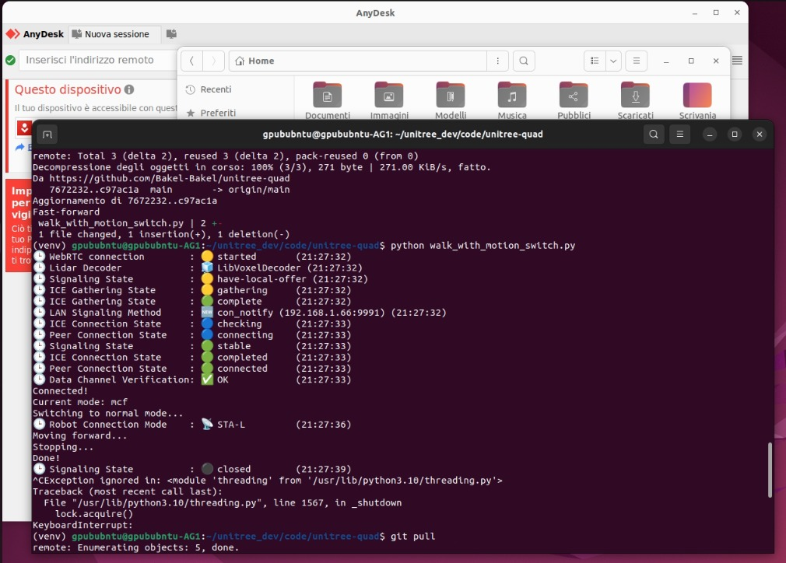
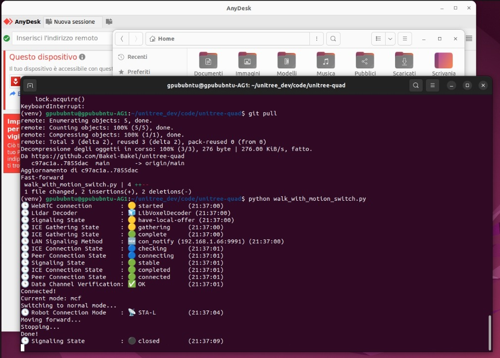
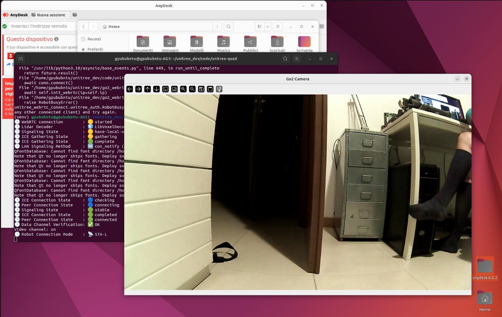
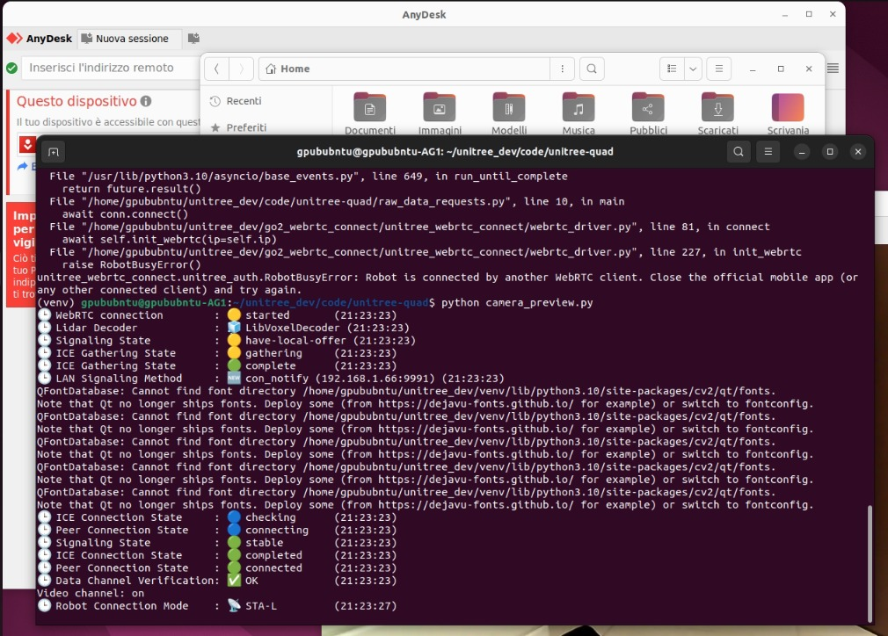

# Unitree Go2 WebRTC examples

Small standalone Python scripts for a **Unitree Go2** over **WebRTC** on your LAN (`WebRTCConnectionMethod.LocalSTA`), same style of path as the official apps when the robot is a Wi‑Fi client on your router.

Scripts live at the repo root (no package). They default to IP **`192.168.1.66`** — change that in each file to match your Go2.

---

## Motion scripts (high-level API)

These four files share one flow:

1. Connect to the robot.
2. **Motion switcher**: query current mode with `api_id` **1001** on `RTC_TOPIC["MOTION_SWITCHER"]`; if it is not **`normal`**, send **1002** to switch and wait **5 seconds**.
3. **Move** via `RTC_TOPIC["SPORT_MOD"]` and `SPORT_CMD["Move"]` with the script-specific velocity.
4. Hold the move for **3 seconds** (comments in code still mention “1 second” in places).
5. Send **Move** with **`x`, `y`, `z` all zero** to stop.

They use `unitree_webrtc_connect` constants (`RTC_TOPIC`, `SPORT_CMD`), logging at `FATAL`, and **`Ctrl+C`** handling in the `if __name__ == "__main__"` block.
What `Ctrl+C` looks like during a run — the script catches it and shuts down cleanly:



| Script | Direction / speed | Move parameter `x` |
|--------|-------------------|----------------------|
| `move_forward_0.3.py` | Forward, moderate | `0.3` |
| `move_back_0.3.py` | Backward, moderate | `-0.3` |
| `move_forward_veryfast.py` | Forward, high | `1` |
| `move_back_veryfast.py` | Intended backward fast (see note) | `1` in repo |
### Demos

Forward motion (`move_forward_0.3.py`):

<video src="assets/videos/Robodog_3.mp4" controls width="600"></video>

Backward motion (`move_back_0.3.py`):

<video src="assets/videos/Robodog_2.mp4" controls width="600"></video>

A clean successful run in the terminal — connection lifecycle, motion-switcher confirming `normal` mode, then `Moving forward... Stopping... Done!`:



**Note:** In the current tree, `move_back_veryfast.py` uses the same **`x: 1`** as `move_forward_veryfast.py` (and the print text still says “Moving forward”). For backward motion, your firmware likely expects a **negative** `x` (as in `move_back_0.3.py`). Fix the sign there if you want a true fast reverse.

---

## `raw_data_requests.py` — Sport API via raw topic string

Lower-level alternative: no motion-switcher step; sends JSON-shaped requests on **`rt/api/sport/request`** with `header.identity` (`id`, `api_id`) and a string **`parameter`**.

- **1004** — stand (`parameter "{}"`), then **2 s** wait.
- **1008** — move with `{"x": 0.3, "y": 0, "z": 0}` for **1 s**, then stop with zeros.
The pose-change command (`api_id 1004`) in action — robot transitions from standing down to lying flat:

<video src="assets/videos/Robodog_1.mp4" controls width="600"></video>

No `KeyboardInterrupt` wrapper in the main path. Same **`LocalSTA`** + IP as the other scripts.

---

## `camera_preview.py` — Live camera (OpenCV)

Opens a window **Go2 Camera**: enables the WebRTC video channel, registers a track callback, decodes frames to BGR, and passes them through a **`Queue`** from an asyncio thread to the main thread for **`cv2.imshow`**.

- Press **`q`** with the window focused to quit.
- Dependencies: **`opencv-python`**, **`numpy`**, **`aiortc`** (plus `unitree_webrtc_connect`).
The live `Go2 Camera` OpenCV window once the WebRTC video channel is up:



A common gotcha: if the official Unitree mobile app is still connected to the dog, you'll get `RobotBusyError`. Close the app, then retry:



---

## Prerequisites

- **Python** 3.9+ (match what `unitree_webrtc_connect` supports).
- **Go2** on the LAN in **Local STA** mode with a known IP.
- **`unitree_webrtc_connect`** installed per [upstream docs](https://github.com/unitreerobotics/unitree_webrtc_connect).

---

## Configuration

- **IP:** search each script for `ip="192.168.1.66"` and set your robot’s address.
- **Speed / duration:** edit the `Move` parameter and `asyncio.sleep(...)` after the move command in the motion scripts; mis-tuned values can make the dog slide, trip, or hit obstacles.

Forward vs backward in this codebase follows **`x`** sign on **`SPORT_CMD["Move"]`**: positive forward (`move_forward_*`), negative for the slow back script (`move_back_0.3.py`).

---

## Installation

```bash
cd Gianni
python3 -m venv .venv
source .venv/bin/activate   # Windows: .venv\Scripts\activate
pip install -r requirements.txt
```

If needed manually: `unitree_webrtc_connect`, and for camera only additionally `opencv-python`, `numpy`, `aiortc`.

---

## Running

```bash
python move_forward_0.3.py
python move_back_0.3.py
python move_forward_veryfast.py
python move_back_veryfast.py      # verify sign matches “back” intent
python raw_data_requests.py
python camera_preview.py           # quit with q
```

---

## Which script?

| Goal | Script |
|------|--------|
| Safe-ish forward jog with mode guard | `move_forward_0.3.py` |
| Backward jog, moderate | `move_back_0.3.py` |
| Faster forward experiment | `move_forward_veryfast.py` |
| Raw payload shape / minimal flow | `raw_data_requests.py` |
| Check camera / latency | `camera_preview.py` |

---

## Safety

These send **real motion commands**. Use clear floor space, good footing, nobody in the swing path, and know how to stop the robot via app or hardware per Unitree. Validate **`x` / `y` / `z`** and sleep durations against your firmware and environment.

---

## Layout

```
Gianni/
├── README.md
├── requirements.txt
├── move_forward_0.3.py
├── move_back_0.3.py
├── move_forward_veryfast.py
├── move_back_veryfast.py
├── raw_data_requests.py
└── camera_preview.py
```

---

## License

No `LICENSE` file in this repo; add one if you redistribute. Respect Unitree / SDK terms for `unitree_webrtc_connect`.
